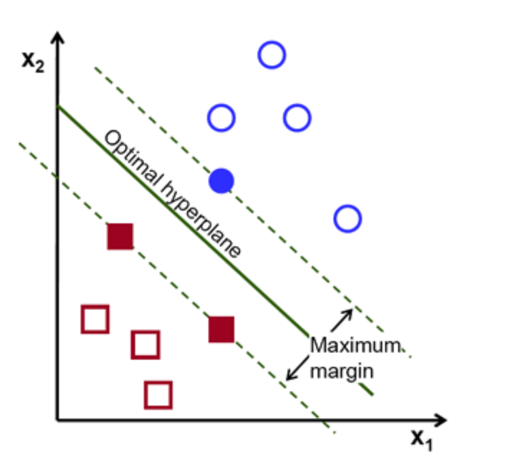

```{r setup, include=FALSE}
knitr::opts_chunk$set(echo = TRUE)
```

## What is it?

Kicking about since 1990, the support vector machine (SVM) is a supervised multidimensional model for classification and also regression.

It separates different classes with a boundary line (hyperplane) that maximizes the distance (margin) between two groups.

Using non-linear kernels it can also work to classify non-linear data.

## How does it work?

Let's look at a simple linear SVM algorithm.

#### First, the support vectors are selected.

The support vectors are the closest data points for each group which maximizes the distance between the other groups. In the below the support vectors are the filled in shapes. Support vectors affect the placement of the hyperplane and are important for building the SVM.

#### Next, the decision boundary is drawn.

The dotted lines are the decision boundaries. These are lines which are as far apart as possible (with the maximum margin). They also separate the data into different classes depending on which side of the boundary line the data point falls.

#### Finally the hyperplane is found!

The line (or plane for many dimensions) with the greatest margin between the points is selected as the hyperplane. Selecting the hyperplane in this way makes classifying additional data points easier.

```{r, echo=FALSE, out.width="50%", fig.cap="Selecting the hyperplane. Source [3]"}

```


### What is a hyperplane?

It is a boundary to distinguish different data classes. The number of features in the data will set the number of dimensions for the hyperplane. If there are only two input features as in the above example the hyperplane will just be a line.

If a non-linear kernel is used (i.e. polynomial or Gaussian) the hyperplane can be all sorts of shapes including curved and spherical. Additionally, optimising parameters for the hyperplane can allow the boundary to wiggle and form very irregular shapes.

## Why use SVM?

* handwriting recognition
* face detection
* email classification

It is useful for finding complex relationships between the data without the need for transforming the data. Good at handling small complex data.


## Pros

- one of the best classifiers for complex data with multiple predictors or where there are more predictors than data points (i.e. multidimensional data)
- uses support vectors which makes the algorithm memory efficient
- able to use custom kernels to deal with non-linear data

## Cons

- prone to overfitting where there are more predictors than data points
- requires data which can be separated by a boundary
- no probability estimates but can use k-fold cross validation
- better with smaller data sets as it has a high training time

#### Sources:

[1. freeCodeCamp](https://www.freecodecamp.org/news/svm-machine-learning-tutorial-what-is-the-support-vector-machine-algorithm-explained-with-code-examples/)
[2. Lilly Chen](https://towardsdatascience.com/support-vector-machine-simply-explained-fee28eba5496)
[3. Hardikkumar M. Dhaduk](https://www.analyticsvidhya.com/blog/2021/07/svm-and-pca-tutorial-for-beginners/)