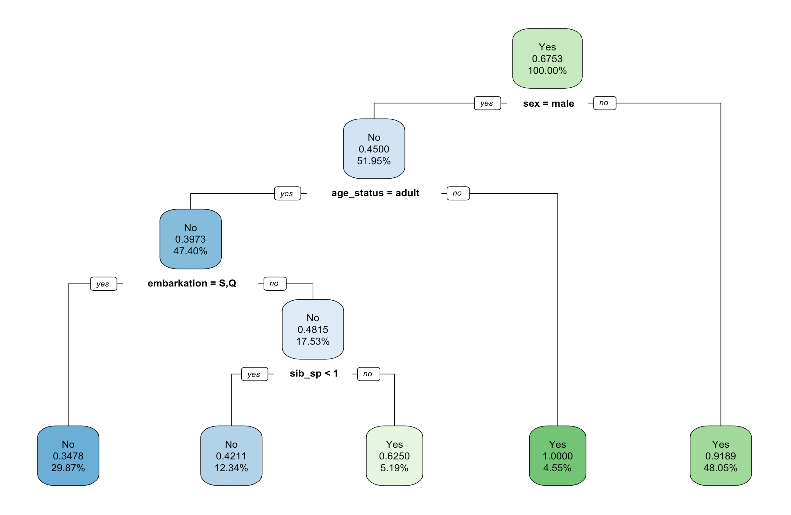

```{r, message=FALSE, warning=FALSE}
library(rpart)
library(rpart.plot)
library(tidyverse)
library(GGally)
library(modelr)
library(yardstick)

titanic_set <- read_csv('data/titanic_decision_tree_data.csv')

shuffle_index <- sample(1:nrow(titanic_set))

# shuffle the data so class order isn't in order - need this for training/testing split later on 
titanic_set <- titanic_set[shuffle_index, ]
```

Cleaning up the data is always the first step. Do the following: 

  * Take only observations which have a `survived` flag (i.e. that aren't missing)  
  * Turn your important variables into factors (sex, survived, pclass, embarkation)  
  * Create an `age_status` variable which groups individuals under (and including) 16 years of age into a category called "child" category and those over 16 into a category called "adult".  
  * Drop the NA  
  * Drop any variables you don't need (`X1`, `passenger_id`, `name`, `ticket`, `far`, `cabin`)  
  
```{r}
titanic_set_clean <- titanic_set %>% 
  drop_na(survived) %>% 
  mutate(
    sex = as_factor(sex),
    survived = factor(survived, levels = c(0,1),
                      labels = c("No","Yes")),
    class = factor(pclass, levels = c(3,2,1), 
                   labels = c("Lower", "Middle", "Upper")),
    embarkation = as_factor(embarked),
    age_status = as_factor(if_else(age > 16, "adult", "child"))
  ) %>% 
  drop_na() %>% 
  select(-c("X1", "passenger_id", "name", "ticket", "fare", "cabin", "embarked", "pclass", "age"))
```

## Question 2 

Have a look at your data and create some plots to ensure you know what you're working with before you begin. Write a summary of what you have found in your plots. Which variables do you think might be useful to predict whether or not people are going to die? Knowing this before you start is the best way to have a sanity check that your model is doing a good job.  

```{r}
titanic_set_clean %>% 
  ggpairs()
```

From the `ggpairs()` it looks like sex, class, embarkation, age might have an impact on survival. let's plot these individually to have a better look.

```{r}
titanic_set_clean %>% 
  ggplot(aes(x = survived, fill = sex)) +
  geom_bar(position = "dodge")

titanic_set_clean %>% 
  ggplot(aes(x = survived, fill = class)) +
  geom_bar(position = "dodge")

titanic_set_clean %>% 
  ggplot(aes(x = survived, fill = embarkation)) +
  geom_bar(position = "dodge")

titanic_set_clean %>% 
  ggplot(aes(x = survived, fill = age_status)) +
  geom_bar(position = "dodge")
```

Looking at the plots in more detail, it is clear that sex (male), age (adult), class (particularly lower class) have a lower survival. There is a possible higher survival for people embarking at Cherbourg.

## Question 3  

Now you can start to build your model. Create your testing and training set using an appropriate split. Check you have balanced sets. Write down why you chose the split you did and produce output tables to show whether or not it is balanced. [**Extra** - if you want to force balanced testing and training sets, have a look at the `stratified()` function in package `splitstackshape` (you can specify multiple variables to stratify on by passing a vector of variable names to the `group` argument, and get back testing and training sets with argument `bothSets = TRUE`)]

```{r}
names <- names(titanic_set_clean)

titanic_split_list <- splitstackshape::stratified(
  titanic_set_clean, names, 0.2, bothSets = TRUE)

titanic_split_test <- titanic_split_list[[1]]
titanic_split_train <- titanic_split_list[[2]]

# check the sets are balanced
titanic_split_test %>% 
  janitor::tabyl(survived)

titanic_split_train %>% 
  janitor::tabyl(survived)

```

I chose an 80% training 20% test split for the data. I want most of my data for training the decision tree model and the remaining to test the model works.

The test train split I have selected is balanced. For the test split there are 10 did not survive and 19 survived (34% and 66%). The train split has 50 did not survive and 104 survived (32.5% and 67.5%). This ratio between the two sets appears balanced to me.

## Question 4      

Create your decision tree to try and predict survival probability using an appropriate method, and create a decision tree plot.

```{r}
titanic_fit <- rpart(
  formula = survived ~ .,
  data = titanic_split_train,
  method = "class"
)
```

```{r}
rpart.plot(titanic_fit,
           yesno = 2,
           fallen.leaves = TRUE,
           faclen = 6,
           digits = 4)
```

## Question 5    

Write down what this tells you, in detail. What variables are important? What does each node tell you? Who has the highest chance of surviving? Who has the lowest? Provide as much detail as you can.

My R crashed while I was in the middle of writing the answers to this question. I have taken a screenshot of the tree which I made, because I'll probably not get the same one again!

here it is:



The decision tree has picked the variables: `sex`, `age_status`, `embarkation`, `sib_sp` as being the most important variables for predicting whether someone will survive or not.

For the root node, looking at all the data together (100%), the most likely result is survived with a probability of 67%.

The first classification category is `sex`. If a passenger is male they have a 0.45 chance of surviving so the most likely result is that they did not survive.

The second classification category is `age_status`. If a passenger is an adult over 16 they have a 0.39 chance of surviving so the most likely result at this node is that they did not survive.

The third classification category is `embarkation`. If a passenger embarked at port in Southhampton (S) or Queenstown (Q) the most likely result was that they did not survive as they had a 0.34 chance of surviving. If they did not embark at port in Southhampton (S) or Queenstown (Q) they also most likely did not survive as they had a 0.48 chance of surviving. This node does not make much sense to me.

The fourth and final classifier is `sib_sp`. This is the number of siblings / spouses aboard the Titanic. If this number is less than 1 i.e. the passenger was travelling alone then they most likely did not survive as their chance of survival was 0.42. However if they did travel with siblings or spouses they were more likely to survive with a probability of 0.62.

The passengers who had the highest chance of survival were females (chance of survival = 0.91) or male children (chance of survival = 1).

## Question 6     

Test and add your predictions to your data. Create a confusion matrix. Write down in detail what this tells you for this specific dataset.  

```{r}
titanic_test_pred <- titanic_split_test %>% 
  add_predictions(titanic_fit, type = "class")

conf_mat <- titanic_test_pred %>% 
  conf_mat(truth = survived,
           estimate = pred)

conf_mat
```
The confusion matrix shows the true positive, true negative and false positive and false negatives which our model predicts in the data. For this model, it predicts 10 of 10 negatives correctly, so 100% true negative rate and zero false negative rate. It predicts 15 of 19 positives correctly, so it has a 0.78% true positive rate and 4 out of 19 positives incorrectly so 0.21 false positive rate.